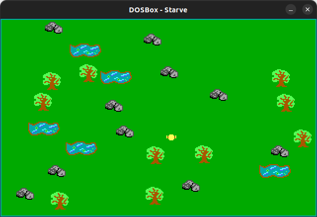
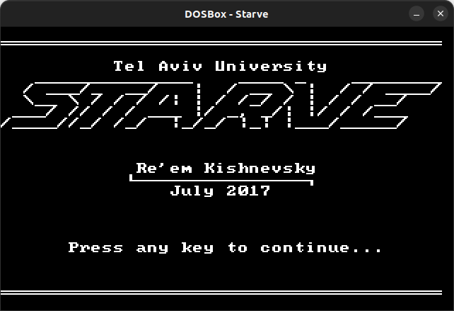
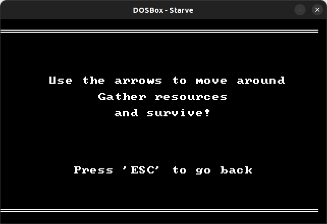

# asm-starve

  

<b>Starve</b> is a small unfinished "survival" game written in x86 assembly for DOS.

# build & run
Run in the terminal:

    TASM GAME.ASM
    TLINK GAME.OBJ
    GAME

_Tested and working on DOSBox version 0.74-3._

# screenshots

  
  

 
